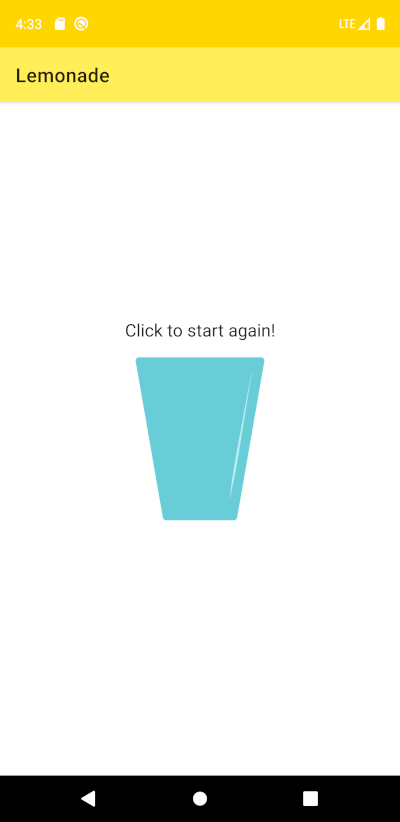
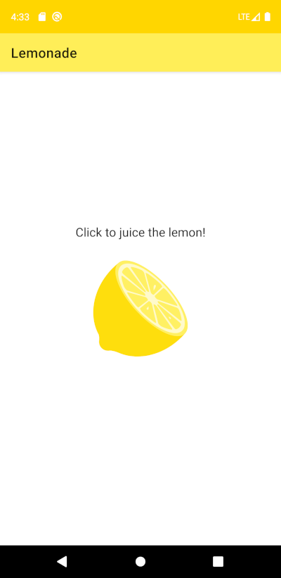

# Lemonade app

This is my implementation of
[Lemonade app project](https://developer.android.com/codelabs/basic-android-kotlin-training-project-lemonade)
According the [last step](https://developer.android.com/codelabs/basic-android-kotlin-training-project-lemonade?continue=https%3A%2F%2Fdeveloper.android.com%2Fcourses%2Fpathways%2Fandroid-basics-kotlin-four%23codelab-https%3A%2F%2Fdeveloper.android.com%2Fcodelabs%2Fbasic-android-kotlin-training-project-lemonade#7) we need to share our developed application. 
[Here](https://www.tiktok.com/@georgenaumov915/video/7042122169811291398) you can see a demonstration video. 

## Here you can see a screenshots of the application: 
|||
|||
||

Project: Lemonade App - Starter Code
==================================

Starter code for the first independent project for [Android Basics in Kotlin](https://developer.android.com/courses/android-basics-kotlin/course)

Introduction
------------

This is the starter code for the Lemonade app project in the [final pathway](https://developer.android.com/courses/pathways/android-basics-kotlin-four) of Android Basics [Unit 1](https://developer.android.com/courses/android-basics-kotlin/unit-1). This project is an opportunity for you to demonstrate the concepts you learned in the unit.

Pre-requisites
--------------

- Complete [Unit 1](https://developer.android.com/courses/android-basics-kotlin/unit-1) of Android Basics in Kotlin

Getting Started
---------------

1. Download the starter code
2. Open the project in Android Studio
3. Complete the project in accordance with the [project instructions](https://developer.android.com/codelabs/basic-android-kotlin-training-project-lemonade)

Tips
----

- Use the provided tests to ensure your app is running as expected
- DO NOT ALTER THE PROVIDED TESTS
